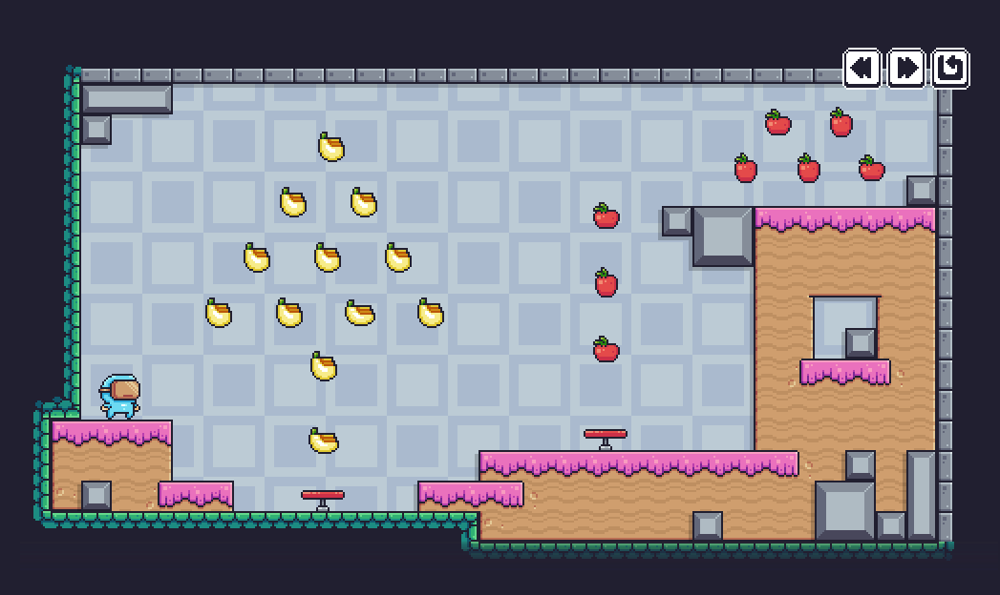

# Pixel Adventure

A project where I'm learning the basics of Flutter Flame.

## Getting Started

Following this [playlist from Spellthorn](https://www.youtube.com/playlist?list=PLRRATgFqhVCh8qD7xmaSbwG1vfaCddvCM). Give his a Sub, he is awesome.

## Progress
- [x] Create the game and place a world
- [x] Adding a player to the game
- [ ] Player movement and controls
- [ ] Collisions, jumping and gravity (Physics)
- [ ] Scrolling backgrounds & collecting fruits
- [ ] Traps!!!
- [ ] Beating levels!
- [ ] Mobile jumping and bug fixings
- [ ] Sound effects!!
- [ ] Chicken inveders all over again!!!!!

